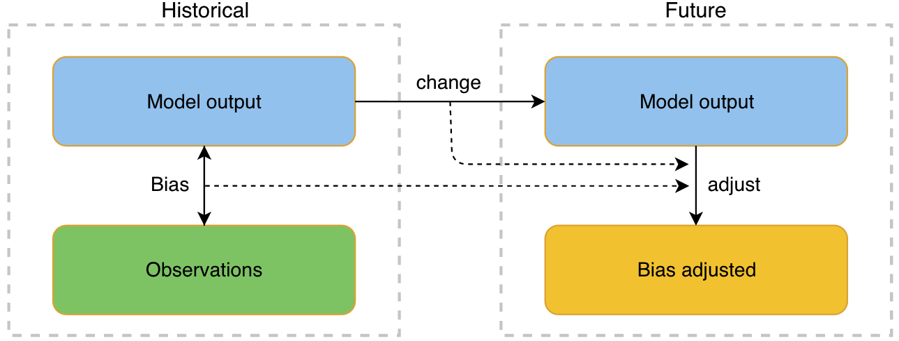
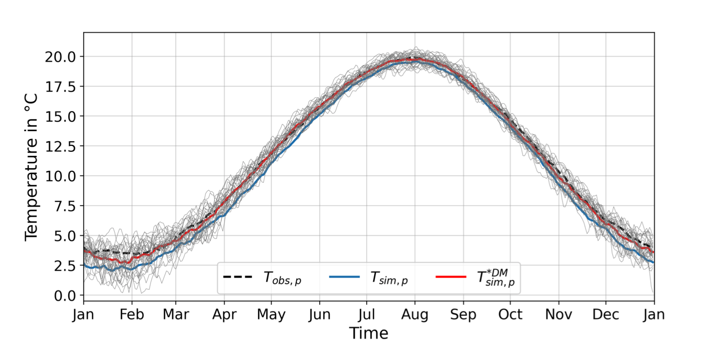

.. This is the introduction

Introduction
=============

|GitHub badge| |License badge| |PyVersions badge| |Downloads badge|
|CodeQL badge| |CI/CD badge| |codecov badge|
|Release date badge| |Release version badge| |DOI badge| |Docs stable|

About
-----

This Python module and the provided data structures are designed
to help minimize discrepancies between modeled and observed climate data of different
time periods. Data from past periods are used to adjust variables
from current and future time series so that their distributional
properties approximate possible actual values.

    Fig 1: Schematic representation of a bias adjustment procedure

In this way, for example, modeled data, which on average represent values
that are too cold, can be bias-corrected by applying an adjustment procedure.
The following figure shows the observed, the modeled, and the bias-corrected values.
It is directly visible that the delta adjusted time series
(:math:`T^{*DM}_{sim,p}`) are much more similar to the observed data (:math:`T_{obs,p}`)
than the raw modeled data (:math:`T_{sim,p}`).

    Fig 2: Temperature per day of year in modeled, observed and bias-adjusted climate data

Available Methods
-----------------

The following bias correction techniques are available:
    Scaling-based techniques:
        * Linear Scaling :func:`cmethods.CMethods.linear_scaling`
        * Variance Scaling :func:`cmethods.CMethods.variance_scaling`
        * Delta (change) Method :func:`cmethods.CMethods.delta_method`

    Distribution-based techniques:
        * Quantile Mapping :func:`cmethods.CMethods.quantile_mapping`
        * Quantile Delta Mapping :func:`cmethods.CMethods.quantile_delta_mapping`

All of these methods are intended to be applied on 1-dimensional time-series climate data.
This module also provides the function :func:`cmethods.CMethods.adjust_3d` that enables
the application of the desired bias correction method on 3-dimensinoal data sets.

Except for the variance scaling, all methods can be applied on stochastic and non-stochastic
climate variables. Variance scaling can only be applied on non-stochastic climate variables.

- Stochastic climate variables are those that are subject to random fluctuations
  and are not predictable. They have no predictable trend or pattern. Examples of
  stochastic climate variables include precipitation, air temperature, and humidity.

- Non-stochastic climate variables, on the other hand, have clear trend and pattern histories
  and can be readily predicted. They are often referred to as climate elements and include
  variables such as water temperature and air pressure.

Examples can be found in the `python-cmethods`_ repository and of course
within this documentation.

References
----------

- Schwertfeger, Benjamin Thomas and Lohmann, Gerrit and Lipskoch, Henrik (2023) *"Introduction of the BiasAdjustCXX command-line tool for the application of fast and efficient bias corrections in climatic research"*, SoftwareX, Volume 22, 101379, ISSN 2352-7110, (https://doi.org/10.1016/j.softx.2023.101379)
- Schwertfeger, Benjamin Thomas (2022) *"The influence of bias corrections on variability, distribution, and correlation of temperatures in comparison to observed and modeled climate data in Europe"* (https://epic.awi.de/id/eprint/56689/)
- Linear Scaling and Variance Scaling based on: Teutschbein, Claudia and Seibert, Jan (2012) *"Bias correction of regional climate model simulations for hydrological climate-change impact studies: Review and evaluation of different methods"* (https://doi.org/10.1016/j.jhydrol.2012.05.052)
- Delta Method based on: Beyer, R. and Krapp, M. and Manica, A.: *"An empirical evaluation of bias correction methods for palaeoclimate simulations"* (https://doi.org/10.5194/cp-16-1493-2020)
- Quantile and Detrended Quantile Mapping based on: Alex J. Cannon and Stephen R. Sobie and Trevor Q. Murdock *"Bias Correction of GCM Precipitation by Quantile Mapping: How Well Do Methods Preserve Changes in Quantiles and Extremes?"* (https://doi.org/10.1175/JCLI-D-14-00754.1)
- Quantile Delta Mapping based on: Tong, Y., Gao, X., Han, Z. et al. *"Bias correction of temperature and precipitation over China for RCM simulations using the QM and QDM methods"*. Clim Dyn 57, 1425–1443 (2021). (https://doi.org/10.1007/s00382-020-05447-4)
